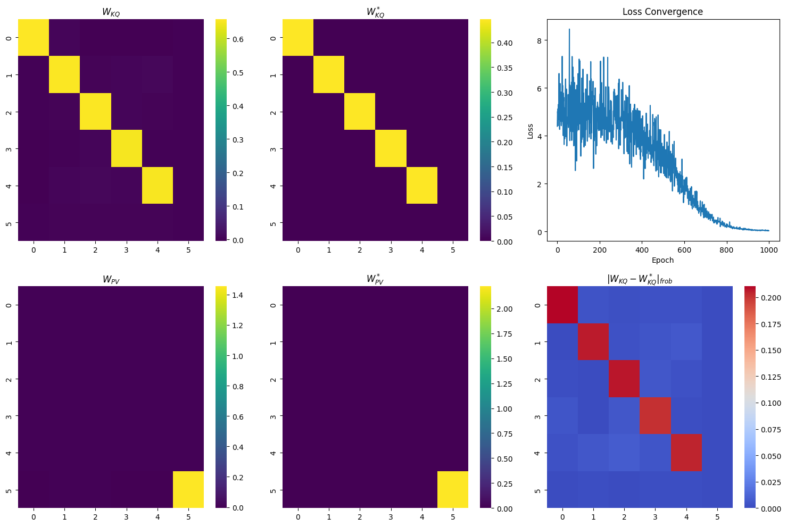

# In-Context Learning

| Title                                                       | PDF                                                         |
|-------------------------------------------------------------|-------------------------------------------------------------|
| **Trained Transformers Learn Linear Models In-Context**    | [PDF](https://www.jmlr.org/papers/volume25/23-1042/23-1042.pdf)    |
| **Learning without training - The implicit dynamics of in-context learning** | [PDF](https://arxiv.org/pdf/2507.16003) 

### Output To Compare

| Task      |     $y$     |  OLS Pred   |  LSA Pred   |
|:---------:|:-----------:|:-----------:|:-----------:|
| 1 of 50   |  -1.1117    |  -1.1117    |  -1.3902    |
| 2 of 50   |   1.7026    |   1.7026    |   1.7500    |
| 3 of 50   |   0.5252    |   0.5252    |   0.6204    |
| 4 of 50   |   2.0304    |   2.0304    |   1.8016    |
| 5 of 50   |   0.3628    |   0.3628    |   0.4924    |
| 6 of 50   |   3.2344    |   3.2344    |   2.8936    |
| 7 of 50   |   0.1720    |   0.1720    |   0.1944    |
| 8 of 50   |  -0.8624    |  -0.8624    |  -0.7823    |
| 9 of 50   |   0.5004    |   0.5004    |   0.5873    |
| 10 of 50  |   4.5377    |   4.5377    |   4.3291    |

---

### Theorem 4: Convergence of Gradient Flow for Linear Self-Attention

### Initialization (Assumption 3)
Let $\sigma > 0$ be a parameter, and let $\Theta \in \mathbb{R}^{d\times d}$ satisfy $|\Theta \Theta^\top|_F = 1$ and $\Theta \Lambda \neq 0_{d \times d}$. The parameters are initialized as:
$$
W_{PV}(0) = \sigma
\begin{bmatrix}
0_{d \times d} & 0_d \\
0_d^\top & 1
\end{bmatrix}, \qquad
W_{KQ}(0) = \sigma
\begin{bmatrix}
\Theta \Theta^\top & 0_d \\
0_d^\top & 0
\end{bmatrix}
$$

### Statement
Consider gradient flow of a linear self-attention network $f_{\mathrm{LSA}}$ over the population loss, using this initialization and scale $\sigma>0$ such that:
$$
\sigma^2 |\Gamma|_{\mathrm{op}} \sqrt{d} < 2
$$
where
$$
\Gamma := \left(1 + \frac{1}{N}\right) \Lambda + \frac{1}{N} \operatorname{tr}(\Lambda) I_d \in \mathbb{R}^{d\times d}
$$

Then **gradient flow converges to a global minimum** of the population loss. Furthermore, $W_{PV}$ and $W_{KQ}$ converge to $W_{PV}^*$ and $W_{KQ}^*$ respectively, where:
$$
W_{KQ}^* =
c^{-1}
\begin{bmatrix}
\Gamma^{-1} & 0_{d} \\
0_{d}^\top & 0
\end{bmatrix}
$$

$$
W_{PV}^* =
c
\begin{bmatrix}
0_{d \times d} & 0_{d} \\
0_{d}^\top & 1
\end{bmatrix}
$$
where the scalar
$$
c = \left[\mathrm{tr}\left(\Gamma^{-2}\right)\right]^{1/4}
$$
<!-- 
### Key Points

- The special initialization ensures the network is "balanced" for the proof.
- The condition on $\sigma$ keeps the flow in a regime ensuring global convergence despite nonconvexity.
- The form of the solution shows that after training, the learned parameters invert the covariance $\Gamma$ (generalizing OLS) and encode the solution in the bottom-right block (for the prediction). -->

<!-- ### Markdown Table (for main result)

| Param | Formula |
|-------|---------|
| $W_{KQ}^*$ | $c^{-1} \begin{bmatrix} \Gamma^{-1} & 0_{d} \\ 0_{d}^\top & 0 \end{bmatrix}$ |
| $W_{PV}^*$ | $c \begin{bmatrix} 0_{d\times d} & 0_{d} \\ 0_{d}^\top & 1 \end{bmatrix}$ |
| $c$ | $c = \left[\mathrm{tr}(\Gamma^{-2})\right]^{1/4}$ |
| $\Gamma$ | $\Gamma = \left(1 + \frac{1}{N}\right) \Lambda + \frac{1}{N} \mathrm{tr}(\Lambda) I_d$ | -->

**This is the main convergence result (Thm 4) in the paper, and those are the exact block matrix forms for the converged self-attention weights.**  
Let me know if you would like intuition or a code translation for $\Gamma$ and $c$!

[1] https://github.com/aayushmanda/ICL

[1] https://www.jmlr.org/papers/volume25/23-1042/23-1042.pdf